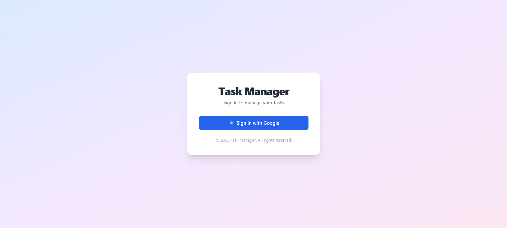
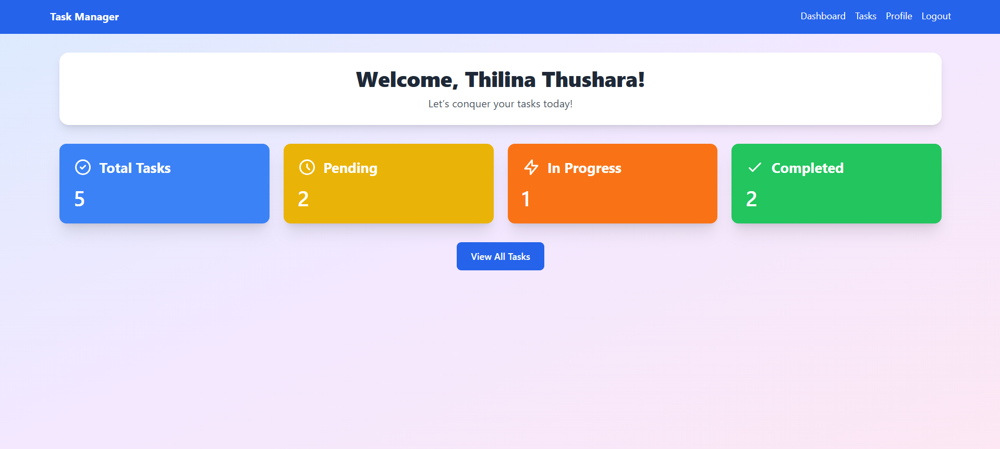
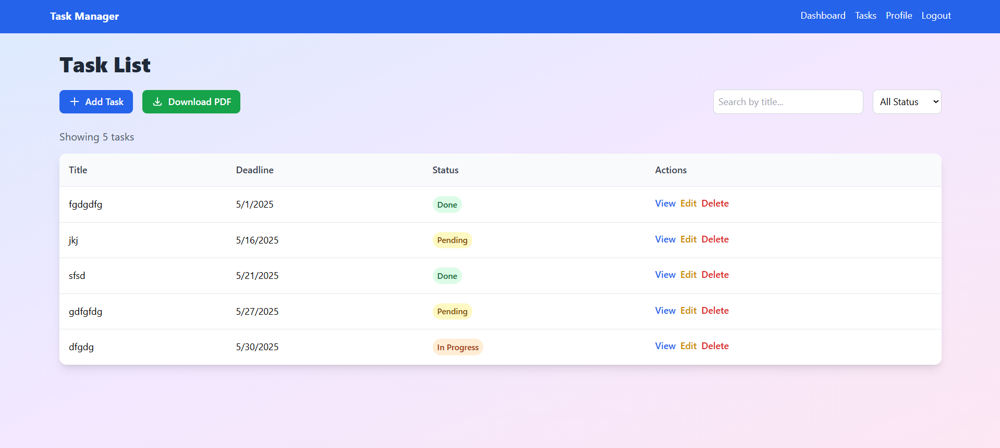
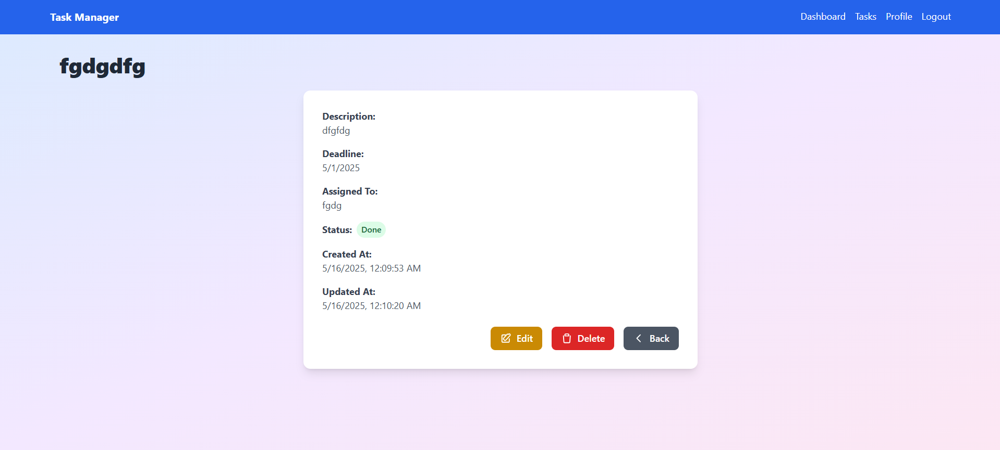
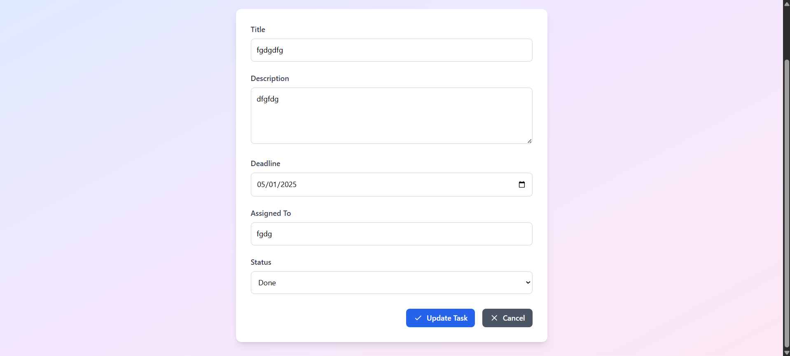
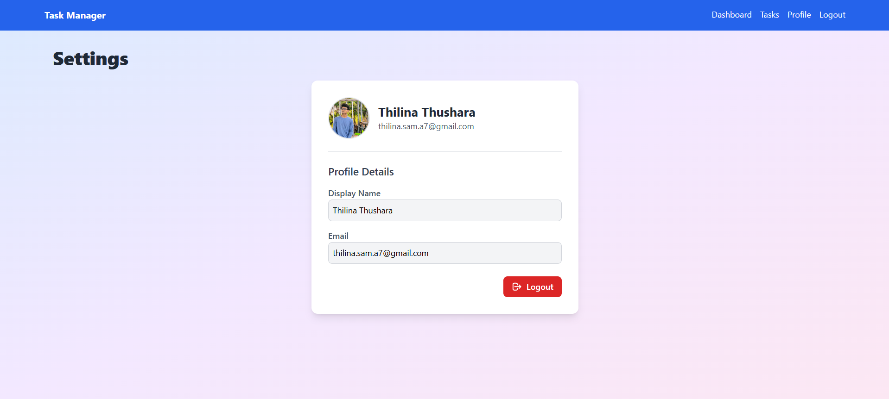

# Task Management System

A full-stack MERN application for managing tasks with Google OAuth authentication, a modern UI, and features like task creation, editing, deletion, and PDF export. Built as a 24-hour coding challenge, this project showcases responsive design, secure authentication, and efficient task management.

## Features

- **User Authentication**: Secure login via Google OAuth.
- **Dashboard**: Displays task statistics (Pending, In Progress, Done) with a modern card-based UI.
- **Task Management**:
  - Create, view, edit, and delete tasks.
  - Search tasks by title and filter by status.
  - Export tasks to PDF with formatted tables.
- **Settings**: View user profile details (name, email, avatar) with a logout option.
- **Responsive Design**: Mobile-friendly UI with Tailwind CSS and animations.
- **Form Validation**: Client-side validation for task creation and editing.


## Tech Stack

- **Frontend**:
  - React (with React Router for navigation)
  - Tailwind CSS (for styling and animations)
  - Axios (for API requests)
  - jsPDF & jspdf-autotable (for PDF export)
- **Backend**:
  - Node.js & Express.js
  - MongoDB & Mongoose (for data storage)
  - Passport.js (for Google OAuth)
  - Express-session (for session management)
- **Database**: MongoDB Atlas
- **Tools**: Git, npm, Vite (for frontend build)

## Prerequisites

- Node.js (v16 or higher)
- MongoDB Atlas account (for cloud database)
- Google Cloud Console account (for OAuth credentials)
- Git
- Text editor (e.g., VS Code)

## Setup Instructions

### 1. Clone the Repository

```bash
git clone https://github.com/IT22003850/task-management-system.git
cd task-management-system
```


### 2. Backend Setup

1. **Navigate to backend directory**:
   ```bash
   cd backend
   ```

2. **Install dependencies**:
   ```bash
   npm install
   ```

3. **Create `.env` file** in `backend/` with the following:
   ```
   PORT=5000
   MONGO_URI=mongodb+srv://<username>:<password>@<cluster>.mongodb.net/<db>?retryWrites=true&w=majority
   SESSION_SECRET=your_session_secret
   GOOGLE_CLIENT_ID=your_google_client_id
   GOOGLE_CLIENT_SECRET=your_google_client_secret
   BACKEND_URL=http://localhost:5000
   FRONTEND_URL=http://localhost:3000
   ```
   - Replace `MONGO_URI` with your MongoDB Atlas connection string.
   - Generate a random `SESSION_SECRET` (e.g., `openssl rand -base64 32`).
   - Obtain `GOOGLE_CLIENT_ID` and `GOOGLE_CLIENT_SECRET` from Google Cloud Console:
     - Create a project in [Google Cloud Console](https://console.cloud.google.com).
     - Enable **Google+ API** (required for OAuth).
     - Create OAuth 2.0 credentials with redirect URI: `http://localhost:5000/auth/google/callback`.

4. **Start the backend**:
   ```bash
   npm start
   ```
   - The backend runs on `http://localhost:5000`.

### 3. Frontend Setup

1. **Navigate to frontend directory**:
   ```bash
   cd ../frontend
   ```

2. **Install dependencies**:
   ```bash
   npm install
   ```

3. **Create `.env` file** in `frontend/` with:
   ```
   REACT_APP_API_URL=http://localhost:5000
   ```

4. **Start the frontend**:
   ```bash
   npm start
   ```
   - The frontend runs on `http://localhost:3000`.

### 4. Test the Application

- Open `http://localhost:3000` in a browser.
- Log in via Google OAuth.
- Test features:
  - View Dashboard statistics.
  - Create, edit, view, and delete tasks in Task List.
  - Search and filter tasks.
  - Download task list as PDF.
  - Check user profile in Settings.
  - Verify form validation in Edit Task.

## Screenshots


- **Login Page**:  
  
- **Dashboard**:  
  
- **Task List**:  
  
- **View Task**:  
  
- **Edit Task**:  
  
- **Settings**:  
  

## Deployment (Optional)

For a live demo, deploy the backend to Render and the frontend to Netlify:

- **Backend (Render)**:
  - Push `backend/` to a GitHub repository.
  - Create a Web Service on Render with Node environment.
  - Set environment variables from `.env`.
  - Update `FRONTEND_URL` to the Netlify URL.
- **Frontend (Netlify)**:
  - Push `frontend/` to a GitHub repository.
  - Deploy on Netlify with build command `npm run build` and publish directory `build`.
  - Set `REACT_APP_API_URL` to the Render backend URL.
- **Google OAuth**:
  - Update redirect URI in Google Cloud Console to the Render backend (e.g., `https://your-backend.onrender.com/auth/google/callback`).

## Troubleshooting

- **CORS Issues**:
  - Verify `FRONTEND_URL` in `backend/.env` matches `http://localhost:3000`.
  - Check `backend/index.js` CORS configuration.
- **MongoDB Connection**:
  - Ensure `MONGO_URI` is correct and MongoDB Atlas allows your IP (Network Access > Add IP > `0.0.0.0/0`).
- **OAuth Errors**:
  - Confirm `GOOGLE_CLIENT_ID`, `GOOGLE_CLIENT_SECRET`, and redirect URI in Google Cloud Console.
- **Frontend API Errors**:
  - Ensure `REACT_APP_API_URL` matches the backend URL.
  - Check browser console (F12 > Console) for errors.

